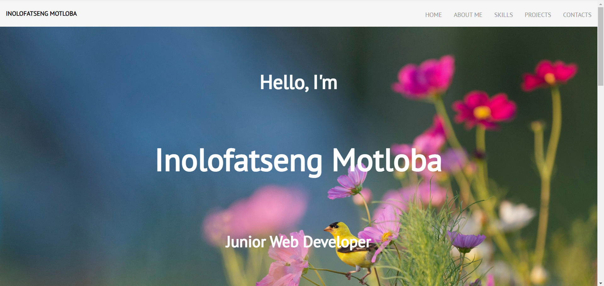

# CDV05 | Simple Developer Portfolio Website 🎨

## Objective
I created a very simple developer portfolio website to showcase my projects, skills, and contact information. This project helped me demonstrate my ability to design and develop a personal website that combines design and user experience, project showcase, content quality, and technical proficiency. I used HTML, CSS and JavaScript (Credits: Arnaud Balland - Codepen)

## Project Showcase
Scroll to see effect

## Link to Portfolio Website
[Portfolio Website](https://inolofatsengmotloba.github.io/INOMOT520_BCL2401_GroupD_02_InolofatsengMotloba_CDV05/)
